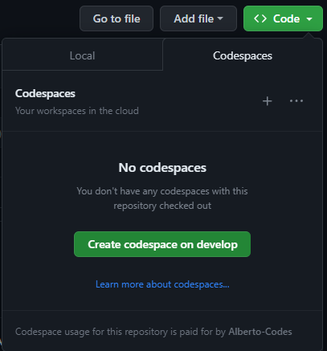

#Prerequisites

GitHub account

Google Cloud account with billing enabled: https://cloud.google.com/billing/docs/how-to/manage-billing-account

# Development Environment

To open this project in Codespaces:

1. Fork this repository to your GitHub account.

2. On your forked repository page, click the "Code" button:



3. Select "Open with Codespaces" from the dropdown.

4. When prompted, create the codespace on the `development` branch. 

This will:

- Create a cloud dev environment. 

- Install dependencies.

- Connect the forked GitHub repo.

- Install VSCode extensions

You can now run scripts and notebooks in the Codespaces IDE.

## Connect to Google Cloud Platform

### Authentication
You will need to authenticate from Github Codespaces to the Google Cloud Platform using the installed Google Cloud CLI SDK.  The following commant will iniate the login flow to authenticate with your GCP account.
```bash
gcloud auth login
```
This will open a browser window prompting you to login and authorize account access.

Login with your Google account.

Click Allow on the consent screen.

Copy the authorization code.

Back in Codespaces, paste the copied authorization code at the prompt to complete login.

### Create GCP Project
You only need to do this once.  If you haven't created a project skip down to Switch to Project section
```bash
gcloud projects create <project name>
```
replace <project name> with a project name of your choosing
### Check Project
```bash
gcloud projects describe <project name>
```

### Switch to Project
```bash
gcloud config set project <project name>
```
```

### Create Bucket
```bash
gsutil mb gs:/<data bucket name>
```
replace <data bucket name> with a bucket name of your choosing
### Download Data locally
```bash
wget https://storage.googleapis.com/download.tensorflow.org/data/creditcard.csv
```

### Copy Data to Bucket
```bash
gsutil cp creditcard.csv gs://<data bucket name>
```

### login to GCP
Go to your dashboard and select the project you created.  You should see the bucket you created and the data file in the bucket.